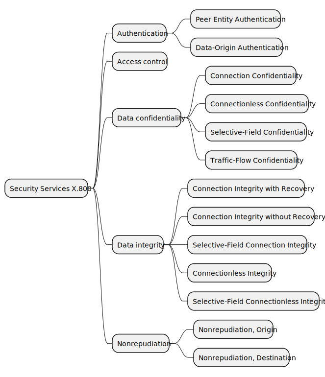
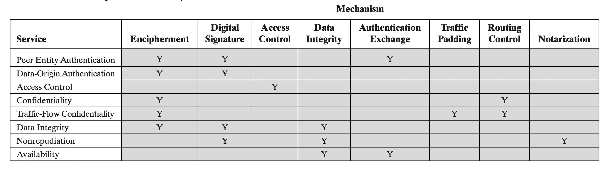

# Chương 1: Giới thiệu

_(Chương 1 Network Security Essentials)_

Các yêu cầu về bảo mật thông tin trong một tổ chức đã được thay đổi một cách lớn trong vài thập kỷ qua. Trước khi sử dụng rộng rãi các thiết bị xử lý dữ liệu, việc bảo mật thông tin được cho là hiệu quả chính là sử dụng các vật dụng vật lý như các tủ hồ sơ chắc chắn với khóa kết hợp để lưu trữ các tài liệu nhạy cảm.

Với sự xuất hiện của máy tính, nhu cầu về một công cụ tự động bảo vệ các tệp cùng các thông tin khác được lưu trữ trong máy tính là hiển nhiên. Điều này đặc biệt đúng với các hệ thống chia sẻ thông tin, và đặc biệt hơn nữa với các hệ thống có thể truy cập bằng hệ thống điên thoại công cộng hoặc Internet. Các công cụ, các thiết kế nhằm mục đích bảo vệ dữ liệu và phòng chống “hacker” được gọi chung là An toàn máy tính - Computer Security.

Thay đổi lơn thứ hai trong ngành an toàn thông tin là sự ra của các hệ thống mạng. Để bảo vệ dữ liệu trong khi truyền tải giữa các máy tính với nhau, các biện pháp bảo mật mạng - network security là cần thiết. Thực ra, thuật ngữ bảo mật mạng không thật sự chính xác, vì rất nhiều công ty, chính phủ và trường học đều nối các thiết bị xử lý dữ liệu của họ với nhau trên một mạng. Một mạng này thường được gọi là một internet, và thuật ngữ bảo mật internet - internet security được sử dụng.

## 1.1: Các khái niệm an toàn thông tin (Computer security concepts)

### Một số khái niệm về an toàn thông tin (A Definition of Computer Security)

**Định nghĩa:**\
Sự bảo vệ cung cấp cho một hệ thống thông tin tự động để đạt được mục tiêu của việc bảo vệ tính toàn vẹn, khả dụng và bảo mật các tài nguyên của hệ thống thông tin (bao gồm phần cứng phần mềm, firmware, thông tin/ dữ liệu và viễn thông)

- **Tính bảo mật (Confidentiality):**

  - **Bảo mật dữ liệu (Data confidentiality):** Đảm bảo rằng thông tin riêng tư hoặc bí mật không được cung cấp hoặc tiết lộ cho những người không có quyền truy cập chúng.
  - **Sự riêng tư:** Chỉ rõ các các nhân có quyền điều khiển, thu thập, lưu trữ, sử dụng các tài nguyên cũng như thông tin của hệ thống

- **Tính toàn vẹn (Integrity):**

  - **Toàn vẹn dữ liệu (Data integrity)** Đảm bảo rằng thông tin và chương trình chỉ được thay đổi theo cách được chỉ định và bởi những người được cho phép.
  - **Toàn vẹn hệ thống (System integrity)** Đảm bảo rằng hệ thống hoạt động bình thường và không thể bị tác động một cách vô ý hay cố tình mà chưa được cho phép

- **Tính khả dụng (Availability)** Đảm bảo hệ thống hoạt động bình thường dối với các đối tượng đã được cấp phép

### Những thách thức của an toàn thông tin (The Challenges of Computer Security)

1. Bảo mật không đơn giản với người mới. Các yêu cầu liên quan đến công việc bảo mật thường được đánh nhãn bởi những từ nghe có vẻ khá đơn giản và trực quan như: bảo mật, xác thực, toàn vẹn...Nhưng để hiểu được hoàn các cơ chế hoạt động thì không hề dễ dàng.
2. Trong việc phát triển một cơ chế bảo mật hoặc thuật toán cụ thể, người ta luôn phải xem xét các tấn công có thể đối với những tính năng bảo mật đó. Trong nhiều trường hợp, các tấn công thành công được là nhờ xem xét kỹ lưỡng các cơ chế bằng nhiều cách làm tìm thấy lỗi hổng để rồi khai thác chúng.
3. Các cơ chế bảo mật thường khá phức tạp vì chỉ xử lý đươc một lượng vấn đề nhất định.
4. Có quá nhiều cơ chế cũng như là chuẩn liên quan đến bảo mật. Việc quyết định cái gì sẽ được dùng ở đầu là một việc cần thiết và không hề dễ dàng.
5. Các cơ chế bảo mật thường liên quan đến nhiều thuật toán hoặc giao thức cụ thể.
6. An ninh máy tính và an ninh mạng là cuộc chiến giữa người cố gắng để tìm ra các lỗ hổng của hệ thống với người luôn cố gắng để vá những lỗ hổng này. Kẻ tấn công chỉ cần và quan tâm một lỗ hổng duy nhất trong khi đó những người thiết kế cũng như duy trì hệ thổng cần quan tâm tất cả các điểm yếu để có được một hệ thống hoàn hảo.
7. Người dùng và quản lý hệ thống thường không quan tâm lắm đến bảo mật khi đến khi các lỗi liên quan đến bảo mật xảy ra
8. Bảo mật yêu cầu theo dõi thường xuyên, thậm chí là liên tục, và điều này là một khó khăn lớn trong môi trường quá tải và yêu cầu lớn về tốc độ như hiện nay.
9. Người ta vẫn cần xem xét có nên đưa có module liên quan đến bảo mật vào hệ thống thay vì suy nghĩ rằng nó là một phần không thể thiếu của hệ thống.
10. Nhiều người dùng coi bảo mật mạnh gây cản trở hiệu quả cũng như tốc độ của hệ thống.

## 1.2: Kiến trúc bảo mật OSI (The OSI security architecture)

Kiến trúc bảo mật OSI định nghĩa một cách tiếp cận có hệ thống đối với 7 tầng của mô hình OSI nhằm đảm bảo bảo mật trong quá trình truyền dữ liệu trong không gian mạng. Nó đươc phát triển như một tiêu chuẩn quốc tế và đã được cộng đồng đón nhận

Kiến trúc bảo mật OSI tâp trung vào một số khái niệm sau:

- **Tấn công bảo mật (Security attack)**: Là một hành động làm tổn hại đến bảo mật thông tin thuộc sở hữu của một tổ chức nào đó.
- **Cơ chế bảo mật (Security mechanism)**: Một tiến trình (hoặc một thiết bị được tích hợp để thực hiện tiến trình) được thiết kế để phát hiện, ngăn chặn tấn công bảo mật hoặc phục hồi tổn hại sau những cuộc tấn công.
- **Dịch vụ bảo mật (Security service)**: Một tiến trình tăng bảo mật của hệ thống xử lý và truyền phát dữ liệu trong tổ chức. Nó sẽ đếm các cuộc tấn công và đưa ra quyết định sẽ tạo ra hoặc sử dụng cơ chế bảo mật nào cho hệ thống.

## 1.3: Tấn công bảo mật (Security attacks)

### 1.3.1 Tấn công thụ động (Passive Attacks)

Các cuộc tấn công thụ động bản chất giống như nghe lén, theo dõi khi mà dữ liệu được truyền đi.
Tấn công thụ động có 2 kiểu là lấy cắp nội dung tin nhắn (release of message contents) và phân tích lưu lượng (traffic analysis).

- **Lấy cắp nội dung tin nhắn (release of message contents)**:

  

  Một cuộc nói chuyện qua điện thoại, một tin nhắn, một tệp tin được gửi đi có thể chứa các thông tin nhạy cảm và bảo mật. Chúng ta cần ngăn những kẻ tấn công biêt được, lấy được những thông tin này.

- **Phân tích lưu lượng (traffic analysis)**:

  

  Giả sử rằng chúng ta có cách che giấu nội dung của tin nhắn hoặc các thông tin khác để đối thủ, ngay cả khi họ bắt được tin nhắn thì cũng không thể trích xuất thông tin từ thông điệp. Kỹ thuật phổ biến để che giấu nội dung là mã hóa. Trong trường họp này kẻ tấn công không thể được được nội dung của tin nhắn mà chỉ hiểu được kiểu mẫu và độ dài của mã hóa.

Tấn công thụ động khó bị phát hiện vì không thay đổi dữ liệu hoặc tài nguyên hệ thống. Thông thường cả người gửi và người nhận tin nhắn đều không thể xác định được tin nhắn được đọc bởi bên thứ 3. Tuy nhiên mã hóa dữ liệu trước khi gửi đi là một cách hữu hiệu để ngăn chặn các cuộc tấn công thụ động thay vì cố tình tìm kiếm và phát hiện các cuộc tấn công.

### 1.3.2 Tấn công chủ động (Active attacks)

Tấn công chủ động liên quan đến thay dổi luồng dữ liệu (data stream) hoặc tạo ra một luồng dữ liệu sai.
Có thể chia tấn công chủ động là 4 loại:

- **Giả mạo (Masquerade)**: Diễn ra khi mà một thực thể giả mạo một thực thể khác. Tấn công giả mạo thường đi kèm theo hình thức tấn công chủ động khác. Ví dụ, trình tự xác thực có thể được mô phỏng sau khi một trình tự xác thực đúng được thực hiện.

  

- **Phát lại (Replay)**: Kẻ tấn công bắt lấy một tin nhắn được truyền đi thông qua một kênh bị động sau đó phát lại tin nhắn gian lận hoặc trì hoãn một thời gian.

  

- **Sửa đổi tin nhắn (Modification of message)**: Kẻ tấn công sửa đổi tin nhắn đã được gửi đi. Người nhận có thể nhận được tin nhắn không an toàn hoặc vô nghĩa. Kiểu tấn công này sử dụng để thao túng nội dung tin nhắn hoặc làm gián đoạn quá trình giao tiếp.

  

- **Từ chối phục vụ (Denial of service - DoS)**: Kẻ tấn công gửi một lượng truy cập lớn vào hệ thống, mạng, hoặc thiết bị, khiến cho thực thể bị tấn công từ chối hoạt động kể cả đối với người dùng đã được xác thực do bị quá tải.

  

Khá là khó để ngăn chặn tuyệt đối các cuộc tấn công chủ động vì có quá nhiều lỗ hổng tiềm ẩn về mặt vật lý, phần mềm và cả mạng. Chính vì thế mục tiêu là phát hiện rồi phục hồi sau bất kỳ sự gián đoạn hoặc chậm trễ nào do chúng gây ra.

### 1.4 Dịch vụ bảo mật (Security services)

X800 định nghĩa 1 dịch vụ bảo mật là 1 dịch vụ đảm bảo an toàn của hệ thống và quá trình truyền dữ liệu
RFC 2828 định nghĩa một tiến trình hoặc một dịch vụ được cấp bở một hệ thống để đưa ra một loại bảo vệ đặc biệt cho tài nguyên của hệ thống, các dịch vụ bảo mật (security services) thực hiện các chính sách bảo mật và các cơ chế bảo mật.

X800 chia các dịch vụ này vào 5 loại và có 14 dịch vụ đặc biệt (specific services).

- **Xác thực (Authentication)**: Là tiến trình xác thực người dùng hoặc thiết bị nhằm mục đích cấp phép hoặc từ chối truy cập vào hệ thống hoặc thiết bị. Khi khởi tạo kết nối cần đảm bảo 2 thực thể phải được xác thực sau đó kết nối của 2 thực thể phải được đảm bảo là không bị cân thiệp.
  - **Xác thực ngang hàng (Peer entity authentication)**: Sử dụng cùng với kết nối logic để xác thực của các thực thể được kết nối. Hai thực thể được coi là ngang hàng nếu như giao tiếp với nhau cùng một giao thức nhưng khác hệ thống. Xác thực ngang hàng sử dụng khi khởi tạo hoặc trong quá trình truyền dữ liệu trên một kết nối. Bên cạnh đó liên tục xác nhận rằng thực thể cần được xác thực không phải là thực thể giả mạo hoặc được phát lại (replay) của kết nối trước đó.
  - **Xác thực nguồn gốc dữ liệu (Data-Origin Authentication)**: Trong truyền tải phi kết nối (connectionless transfer), đảm bảo rằng thông tin mà người nhận nhận được là giống với thông tin gửi đi. Kiểu dịch vụ này không hỗ trợ chống lại việc nhân bản dữ liệu.
- **Điểu khiển truy cập (Access control)**: Liên quan đến việc sử dụng các chính sách và thủ tục để xác định ai được phép truy cập các tài nguyên cụ thể trong một hệ thống. Là khả năng giới hạn và điều khiển các truy cập vào máy chủ hệ thống. Để làm được vậy mỗi thực thể muốn truy cập vào hệ thống trước tiên cần phải được xác thực.
- **Bảo mật dữ liệu (Data confidentiality)**: Bảo vệ dữ liệu khỏi bị truy cập hoặc tiết lộ một cách trái phép.
  - **Bảo mật kết nối (Connection confidentiality)**: Bảo vệ dữ liệu của tất cả người dùng trên một kết nối.
  - **Bảo mật phi kết nối (Connectionless confidentiality)**: Bảo vệ dữ liệu của tất cả người dùng trong một khối dữ liệu đơn (a single data block).
  - **Bảo mật lưu lượng luồng dữ liệu (Traffic-Flow confidentiality)**: Là các kỹ thuật phát minh ra để ẩn/ làm giả các mẫu lưu lượng (traffic pattern) nhằm ngăn các cuộc tấn công bằng cách phân tích lưu lượng (statistical traffic analysis attacks).
- **Toàn vẹn dữ liệu (Data integrity)**: Đảm bảo rằng dữ liệu nhận được chính xác được gửi đi bởi một thực thể đã được cấp phép.
  - **Connection integrity with recovery**: Đảm bảo mọi dữ liệu của người dùng đã kết nối chính xác, nhất quán. Phát hiện mọi thao tác chỉnh sửa, thêm xoá, hoặc phát phát dư liêu trên đường truyền. Nếu phát hiện các thao tác trên dịch vụ sẽ cố gắng khôi phục dữ liệu về tình trạng "toàn vẹn".
  - **Connection integrity without recovery**: Chỉ ra các hành động có can thiệp tới dữ liệu nhưng không cố gắng khôi phục dữ liệu.
  - **Selective-Field Connection integrity**: Cung cấp tính đúng đắn cho một số trường thuộc khối dữ liệu, chỉ ra các trường đã bị sửa, thêm, xoá, hoặc phát lại trong số các trường đã chọn.
  - **Connectionless integrity**: Cung cấp tính toàn vẹn của một khối dữ liệu phi kết nối (connectionless data block), phát hiện sửa đổi và phát lại dữ liệu.
  - **Selective-Field Connectionless Integrity**: Cung cấp tính đúng đăn cho một số trường thược khối dữ liệu phi kết nối (connectionless data block), chỉ ra trường nào bị thay đổi trong các trường đã chọn.
- **Nonrepudiation**: Ngăn chặn người nhận hoặc người gửi từ chối một tin nhắn đã được truyền đi. Như vậy, khi mà một tin nhắn đã được gửi đi, người nhận có thể chứng mình rằng người gửi đã thực sự gửi tin nhắn đó. Tương tự, khi mà tin nhắn được nhận, người gửi cũng có thể chứng minh rằng người nhận đã thật sự nhận được tin nhắn đó.

### 1.5 Cơ chế bảo mật (Security mechanisms)

- **Cơ chế bảo mật cụ thể (Specific security mechanisms)**
  - **Encipherment (Mã Hoá)**: Sử dụng các thuật toán để biến đổi dữ liệu một cách khó hiểu. Việc mã hoá và giải mã có thể phụ thuộc vào 0 hoặc nhiều khoá.
  - **Digital Signature (Chữ ký số)**: Dữ liệu được thêm vào tin nhắn hoặc tài liệu cho phép người nhận xác thực được nguồn gốc và tính đúng đắn của thông tin nhận được.
  - **Access Control (Kiểm soát truy cập)**: cơ chế kiểm tra các quyền truy cập vào tài nguyên.
  - **Data Integrity (Toàn vẹn dữ liệu)**: Các cơ chế sử dụng để đảm bảo tính đúng đắn của khối dữ liệu hoặc luồng dữ liệu (stream of data units).
  - **Authentication Exchange (Trao đổi xác thực)**: Một cơ chế xác thực danh tính của thực thể bằng cách trao đổi thông tin. _Một đối tượng giải mã thành công một tin nhắn bằng cách sử dụng 1 khoá trong cặp khoá (key pair). Họ có thể suy ra người có khóa tương ứng, cũng chính là danh tính người gửi tin nhắn_
  - **Traffic Padding (Đệm lưu lượng)**: Là kỹ chèn các bit vào các khoảng trống trong luồng dữ liệu (data stream) nhằm hạn chế, gây cản trở việc phân tích lưu lượng.
  - **Routing Control (Kiểm soát định tuyến)**: Cho phép lựa chọn đường đi về mặt vật lý cho một số dữ liệu, có thể thay đổi đường đi này, đặc biệt là khi có nghi ngờ về việc thiếu bảo mật.
  - **Notarization (Công chứng)**: Sử dụng một bên thứ 3 để đảm bảo bảo mật trong quá trình truyền dữ liệu.
- **Cơ chế bảo mật phổ biến (Pervasive security mechanisms)**: Các cơ chế không dành riêng cho bất kỳ giao thức hay dịch vụ bảo mật OSI cụ thể nào.
  - **Trusted Functionality (Chức năng đáng tin cậy)**: thứ được coi là đúng đối với một số tiêu chí.
  - **Security Label (Nhãn bảo mật)**: Tạo ràng buộc với một tài tài nguyên (hoặc một khối dữ liệu) để đặt tên hoặc định rõ các thuộc tính bảo mật của tài nguyên đó.
  - **Event Detection (Phát hiện sự kiện)**: Phát hiện các sự kiện liên quan tới bảo mật.
  - **Security Audit Trail (Con đường kiểm tra bảo mật)**: Thu tập dữ liệu có tiềm năng để thuận tiện đánh giá bảo mật.
  - **Security Recovery (Phục hồi bảo mật)**: Tuỳ theo yêu cầu của cơ chế, chẳng hạn như các chức năng quản lý và xử lý sự kiện, đồng thời thực hiện các hành động khôi phục.

**Mối quan hệ giữa Dịch vụ bảo mật và Cơ chế bảo mật (Relationship Between Security Services And Mechanisms)**

### 1.6 A MODEL FOR NETWORK SECURITY

# New words

| EN            | VI                       |
| ------------- | ------------------------ |
| assess        | đánh giá                 |
| assurance     | sự đảm bảo               |
| compound      | hỗn hợp                  |
| compromises   | thỏa hiệp, làm tổn hại   |
| concerned     | lo lắng, quan tâm        |
| confidential  | bảo mật                  |
| devise        | chỉ ra, phát minh        |
| enumerate     | liệt kê                  |
| establishment | sự thành lập             |
| exploit       | khai thác                |
| facilitate    | tạo điều kiện            |
| feasible      | khả thi                  |
| grocery       | cửa hàng tạp hóa         |
| influence     | ảnh hưởng                |
| integrity     | tính toàn vẹn            |
| intend        | có dự định               |
| interfere     | can thiệp                |
| involve       | liên quan đến            |
| legitimate    | hợp pháp                 |
| mechanism     | cơ chế                   |
| novice        | người mới                |
| opponent      | phản đối, dịch thủ       |
| perceive      | nhận thức, lĩnh hội      |
| perhaps       | có lẽ                    |
| portion       | phần, đoạn trích, lô đất |
| prove         | chứng minh               |
| subtle        | tinh vi, xảo trá         |
| tendency      | khuynh hướng             |
| typically     | tiêu biểu                |
| violation     | sự vi phạm               |
